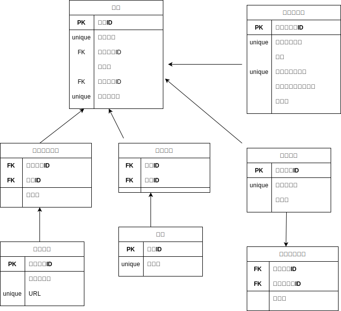

# データベース

## データ例(正規化前)
### ＜記事＞
<table>
    <tr>
        <th>タイトル</th>
        <th>作者</th>
        <th>作成日</th>
        <th>公開範囲</th>
        <th>本文</th>
        <th>タグ1</th>
        <th>タグ2</th>
        <th>タグ3</th>
        <th>タグ4</th>
        <th>タグ5</th>
        <th>タグ6</th>
        <th>タグ7</th>
        <th>タグ8</th>
        <th>タグ9</th>
        <th>タグ10</th>
        <th>添付資料1</th>
        <th>添付資料2</th>
        <th>添付資料3</th>
        <th>添付資料4</th>
        <th>添付資料5</th>
    </tr>
    <tr>
        <th>DXってなんなん？</th>
        <th>kuboshu83</th>
        <th>2021/9/5</th>
        <th>勉強会</th>
        <th>https://...</th>
        <th>DX</th>
        <th>IT</th>
        <th>エンジニア</th>
        <th>非エンジニア</th>
        <th>経営</th>
        <th>効率化</th>
        <th>ツール</th>
        <th></th>
        <th></th>
        <th></th>
        <th>予算.csv</th>
        <th>ツール紹介.pdf</th>
        <th>打ち合わせメモ.md</th>
        <th></th>
        <th></th>
    </tr>
    <tr>
        <th>Rustってどうよ？</th>
        <th>kuboshu83</th>
        <th>2021/9/5</th>
        <th>勉強会</th>
        <th>https://...</th>
        <th>Rust</th>
        <th>プログラミング</th>
        <th>入門</th>
        <th></th>
        <th></th>
        <th></th>
        <th></th>
        <th></th>
        <th></th>
        <th></th>
        <th>sample_code.rs</th>
        <th>ドキュメント.pdf</th>
        <th></th>
        <th></th>
        <th></th>
    </tr>
    <tr>
        <th>データベース入門</th>
        <th>akira</th>
        <th>2020/3/4</th>
        <th>全体</th>
        <th>https://...</th>
        <th>RDB</th>
        <th>NoSQL</th>
        <th>入門</th>
        <th>MySQL</th>
        <th>PostgreSQL</th>
        <th>MongoDB</th>
        <th>Sqlite</th>
        <th>正規化</th>
        <th>N+1問題</th>
        <th>チューニング</th>
        <th>画像1.jpg</th>
        <th>ドキュメント.pdf</th>
        <th>画像２.jpg</th>
        <th></th>
        <th></th>
    </tr>
</table>

### ＜アカウント＞
<table>
    <tr><th>アカウント名</th><th>メールアドレス</th><th>パスワードハッシュ</th><th>登録日</th><th>グループ1</th><th>グループ2</th><th>グループ3</th></tr>
    <tr><th>kuboshu83</th><th>kuboshu@hoge.com</th><th>*******</th><th>2020/1/3</th><th>勉強会</th><th>サバゲー同好会</th><th></th></tr>
    <tr><th>akira</th><th>akira@hoge.com</th><th>*******</th><th>2019/3/10</th><th>勉強会</th><th></th><th></th></tr>
</table>

## テーブル案(正規化後) 

### ＜記事＞
<table>
    <tr>
        <th><u>記事ID</u></th>
        <th>タイトル(unique)</th>
        <th>ユーザーID(FK)</th>
        <th>作成日</th>
        <th>グループID(FK)</th>
        <th>本文リンク(unique)</th>
    </tr>
    <tr>
        <td>a0000</td>
        <td>DXってなんなん？</td>
        <td>u0001</td>
        <td>2021/9/5</td>
        <td>g0001</td>
        <td>https://...</td>
    </tr>
    <tr>
        <td>a0001</td>
        <td>Rustってどうよ？</td>
        <td>u0001</td>
        <td>2021/9/5</td>
        <td>g0001</td>
        <td>https://...</td>
    </tr>
    <tr>
        <td>a0002</td>
        <td>データベース入門</td>
        <td>u0002</td>
        <td>2020/3/4</td>
        <td>g0000</td>
        <td>https://...</td>
    </tr>
</table>

### ＜タグ＞
<table>
    <tr><th><u>タグID</u></th><th>タグ名(unique)</th></tr>
    <tr><td>t0001</td><td>DX</td></tr>
    <tr><td>t0002</td><td>IT</td></tr>
    <tr><td>t0003</td><td>エンジニア</td></tr>
    <tr><td>t0004</td><td>非エンジニア</td></tr>
    <tr><td>t0005</td><td>経営</td></tr>
    <tr><td>t0006</td><td>効率化</td></tr>
    <tr><td>t0007</td><td>ツール</td></tr>
    <tr><td>t0008</td><td>Rust</td></tr>
    <tr><td>t0009</td><td>プログラミング</td></tr>
    <tr><td>t0010</td><td>入門</td></tr>
    <tr><td>t0011</td><td>RDB</td></tr>
    <tr><td>t0012</td><td>NoSQL</td></tr>
    <tr><td>t0013</td><td>MySQL</td></tr>
    <tr><td>t0014</td><td>PostgreSQL</td></tr>
    <tr><td>t0015</td><td>MongoDB</td></tr>
    <tr><td>t0016</td><td>Sqlite</td></tr>
    <tr><td>t0017</td><td>正規化</td></tr>
    <tr><td>t0018</td><td>N+1問題</td></tr>
    <tr><td>t0019</td><td>チューニング</td></tr>
</table>

### ＜タグ登録＞
<table>
<tr><th><u>記事ID(FK)</u></th><th><u>タグID(FK)</u></th><tr>
<tr><td>a0001</td><td>t0001</td><tr>
<tr><td>a0001</td><td>t0002</td><tr>
<tr><td>a0001</td><td>t0003</td><tr>
<tr><td>a0001</td><td>t0004</td><tr>
<tr><td>a0001</td><td>t0005</td><tr>
<tr><td>a0001</td><td>t0006</td><tr>
<tr><td>a0001</td><td>t0007</td><tr>
<tr><td>a0002</td><td>t0008</td><tr>
<tr><td>a0002</td><td>t0009</td><tr>
<tr><td>a0002</td><td>t0010</td><tr>
<tr><td>a0003</td><td>t0011</td><tr>
<tr><td>a0003</td><td>t0012</td><tr>
<tr><td>a0003</td><td>t0010</td><tr>
<tr><td>a0003</td><td>t0013</td><tr>
<tr><td>a0003</td><td>t0014</td><tr>
<tr><td>a0003</td><td>t0015</td><tr>
<tr><td>a0003</td><td>t0016</td><tr>
<tr><td>a0003</td><td>t0017</td><tr>
<tr><td>a0003</td><td>t0018</td><tr>
<tr><td>a0003</td><td>t0019</td><tr>
</table>

### ＜ファイル＞
<table>
    <tr><th><u>ファイルID</u></th><th>ファイル名</th><th>URL(unique)</th></tr>
    <tr><td><u>f0000</u></td><td>予算.csv</td><td>http://...</td></tr>
    <tr><td><u>f0001</u></td><td>ツール紹介.pdf</td><td>http://...</td></tr>
    <tr><td><u>f0002</u></td><td>打ち合わせメモ.md</td><td>http://...</td></tr>
    <tr><td><u>f0003</u></td><td>sample_code.sr</td><td>http://...</td></tr>
    <tr><td><u>f0004</u></td><td>ドキュメント.pdf</td><td>http://...</td></tr>
    <tr><td><u>f0005</u></td><td>画像1.jpg</td><td>http://...</td></tr>
    <tr><td><u>f0006</u></td><td>ドキュメント.pdf</td><td>http://...</td></tr>
    <tr><td><u>f0007</u></td><td>画像2.jpg</td><td>http://...</td></tr>
</table>

### ＜ファイル登録＞
<table>
    <tr><th><u>ファイルID(FK)</u></th><th><u>記事ID(FK)</u></th><th>登録日</th><tr>
    <tr><th><u>f0000</u></th><th><u>a0000</u></th><th>2021/9/5</th><tr>
    <tr><th><u>f0001</u></th><th><u>a0000</u></th><th>2021/9/5</th><tr>
    <tr><th><u>f0002</u></th><th><u>a0000</u></th><th>2021/9/5</th><tr>
    <tr><th><u>f0003</u></th><th><u>a0001</u></th><th>2021/9/5</th><tr>
    <tr><th><u>f0004</u></th><th><u>a0001</u></th><th>2021/9/5</th><tr>
    <tr><th><u>f0005</u></th><th><u>a0002</u></th><th>2020/3/4</th><tr>
    <tr><th><u>f0006</u></th><th><u>a0002</u></th><th>2020/3/4</th><tr>
    <tr><th><u>f0007</u></th><th><u>a0002</u></th><th>2020/3/4</th><tr>
</table>

### ＜アカウント＞
<table>
    <tr><th><u>アカウントID</u></th><th>アカウント名(unique)</th><th>名前</th><th>メールアドレス(unique)</th><th>パスワードハッシュ</th><th>登録日</th></tr>
    <tr><td>u0000</td><td>root</td><td>管理者</td><td>root@hoge.com</td><td>*******</td><td>2020/1/3</td></tr>
    <tr><td>u0001</td><td>kuboshu83</td><td>窪 秀</td><td>kuboshu@hoge.com</td><td>*******</td><td>2020/1/3</td></tr>
    <tr><td>u0002</td><td>akira</td><td>高野 明</td><td>akira@hoge.com</td><td>*******</td><td>2019/3/10</td></tr>
</table>

- サイト管理者は全ての記事に対する閲覧、プライバシー保護的に編集権限を持たせて平気か？

### ＜グループ＞
<table>
    <tr><th><u>グループID</u></th><th>グループ名(unique)</th><th>作成日</th></tr>
    <tr><td>g0000</td><td>全体</td><td>2019/1/2</td></tr>
    <tr><td>g0001</td><td>勉強会</td><td>2019/6/4</td></tr>
    <tr><td>g0002</td><td>サバゲー同好会</td><td>2020/2/2</td></tr>
    <tr><td>g0003</td><td>電子工作</td><td>2020/5/12</td></tr>
</table>

### ＜グループ登録＞
<table>
    <tr><th><u>グループID(FK)</u></th><th><u>アカウントID(FK)</u></th><th>登録日</th></tr>
    <tr><td>g0000</td><td>u0001</td><td>2020/1/3</td></tr>
    <tr><td>g0000</td><td>u0002</td><td>2019/3/10</td></tr>
    <tr><td>g0001</td><td>u0001</td><td>2020/4/1</td></tr>
    <tr><td>g0002</td><td>u0001</td><td>2020/4/1</td></tr>
    <tr><td>g0001</td><td>u0002</td><td>2020/4/1</td></tr>
</table>

