# 画面構成

# 画面詳細

## トップ画面

 URLを入力すると最初に表示される画面です。新着情報蘭には閲覧権限が全ユーザーの記事のみが表示されます。

## ログイン画面

ユーザー認証を行う画面です。

## ユーザートップ画面

ログイン後のトップページです。

## 記事作成画面

記事を新規に作成するページです。

## 記事一覧表示画面

ユーザーが作成した記事の一覧を表示する画面です。

## 下書き一覧表示

ユーザーが作成中で一時保存した記事の一覧を表示する画面です。下書き時点では公開グループが決まっていない可能性もあるため、
グループによるフィルタ機能はない。

## グループ作成

公開グループを新規に作成する画面です。グループの新規作成をクリックするとポップアップされます。

