# 画面構成

## ページ構成

[ページリスト]
- トップ
- 検索結果
- 記事閲覧
- ユーザー登録
- ログイン
- ユーザートップ
- 記事管理
- 下書き管理
- 新規作成
- 記事編集
- グループ管理
- グループ作成
- グループ編集
- 削除確認
- 投稿確認
- 保存確認
- アカウント管理

[ページ遷移]

# ページ詳細

## 「トップ」ページ

ページ名：index.html

 URLを入力すると最初に表示される画面です。記事検索用の検索欄が実装されてます。また、新着記事欄には閲覧権限が全ユーザーの記事のみが表示されます。

 ### [機能]

 - 記事検索
 - 新着記事表示(ページネーションで実装)
 - 新着記事をクリックすると「記事閲覧」ページに遷移する。
 - 「ユーザー登録」ページへの遷移
 - 「ログイン」ページへの遷移

## 「検索結果」ページ

ページ名：search_result.html

記事の検索結果の一覧を表示します。表示内容はログイン前後、またログインアカウントで変化します。
表示結果はログインアカウントに閲覧権限がある記事のみが表示されます。ログイン前の場合は一般公開の記事のみが表示されます。

### [機能(共通))]

- ユーザー権限に応じた検索結果の表示する。(ページネーションで実装)
- 別のワードで再際検索する。
- 検索結果をクリックすると「記事閲覧」ページに遷移する。

### [機能(ログイン前)]

- 「トップ」ページへ遷移する。
- 「ログイン』ページへ遷移する。
- 「ユーザー登録」ページへ遷移する。

### [機能(ログイン済み)]

- 「ユーザートップ」ページへ遷移する。
- ログアウト
- 「アカウント管理」ページへ遷移する。

## 「記事閲覧」ページ

ページ名：disp_article.html

## 「ユーザー登録」ページ

ページ名：user_registration.html

ユーザー登録を行う画面です。

[機能]

- ユーザー登録
- ユーザー登録完了後に「ログイン」ページに遷移する。
- 「キャンセル」で１つ前のページに戻る。
- 入力内容に問題無いかをリアルタイムで確認する。
- 登録後に登録完了メールを送信する。

[アカウント名条件]

- 英数字と"_"のみで8文字以上20文字以下であること。
- 他の登録済みアカウント名と重複しないこと。

[メールアドレス条件]

- 有効なメールアドレスで100文字以下であること。(ただし、アドレスの存在までは確認しない)
- 他の登録済みアドレスと重複しないこと。

[パスワード条件]

- 英数字と"_"のみで8文字以上50文字以下であること。

## 「ログイン」ページ

ページ名：login.html

ユーザー認証を行うページです。

[機能]
- 認証が成功すると「ユーザートップ」ページに遷移します。
- 「キャンセル」ボタンを押すと、１つ前のページに遷移します。
- 「ユーザー登録」から「ログイン」にきた場合、「キャンセル」ボタンで「トップ」ページに遷移します。

## 「ユーザートップ」ページ

ページ名：user_top.html

ログイン後のトップページです。ログイン後はこのページを起点にしてサービスを利用します。

[機能]
- ログアウトする。
- 「記事管理」ページへ遷移する。
- 「グループ管理」ページへ遷移する。
- 「アカウント管理」ページへ遷移する。
- 記事を検索して、「検索結果」ページに遷移する。
- ユーザーに閲覧権限のある記事を、最新投稿順で表示します。(最大10個)
- ユーザーが作成した記事を、最新投稿順で表示します。(最大5個)
- 最新記事一覧の記事をクリックすると [記事閲覧」ページに遷移する。

## 「記事管理」ページ

ページ名：article_management.html

記事の作成・編集・削除などユーザーが作成した記事を管理するための画面です。

[機能]
- ログアウト
- 「アカウント管理」ページに遷移する。
- 「下書き管理」ページに遷移する。
- 「新規作成」ページに遷移する。
- 「ユーザートップ」ページに遷移する。
- 投稿済みの記事を、最新順に表示する。(ページネーションで実装する)
- 投稿済み記事一覧表示をグループでフィルタリングする。
- 一覧の記事をクリックすることで「記事閲覧」ページに遷移する。
- 「編集」ボタンをクリックすることで、「記事編集」ページに遷移する。
- 「削除」ボタンをクリックすることで、「削除確認」ページに遷移する。

## 「新規作成」ページ

ページ名：new_article.html

記事を新規に作成するページです。

[機能]
- 「ログアウト」ボタンを押すと「保存確認」ウィンドがポップアップする。
- 「アカウント管理」をクリックすると「保存確認」ウィンドがポップアップして、続行すると「アカウント管理」ページへ遷移します。
- 「トップへ」ボタンを押すと「保存確認」ウィンドがポップアップして、続行すると「ユーザートップ」ページへ遷移します。
- タイトル設定する。
- タグを設定する。(最大10個、順不同)
- 本文を作成する。
- ドラッグ&ドロップで画像を本文に挿入する。
- 公開グループを選択する。
- データなどの関連ファイルを登録
- 記事の編集とプレビューが切り替えられる。
- 「一時保存」ボタンを押すと、作成中の記事を下書きとして保存して「下書き管理」ページに遷移する。
- 「破棄」をクリックすると、編集中の記事を破棄して「記事管理」ページに遷移する。
- 「投稿」をクリックすると、「投稿確認」ページに遷移する。

## 「記事編集」ページ

ページ名：edit_article.html

投稿済みの記事を編集するためのページです。投稿済み記事のタイトルは変更できません。

[機能]
「投稿」ボタンの表示が「更新」ボタンに変更されている以外、機能的には「新規作成」ページと同じ

## 「下書き管理」ページ

ページ名：draft_management.html

ユーザーが作成中で一時保存した記事の一覧を表示する画面です。下書き時点では公開グループが決まっていない可能性もあるため、
グループによるフィルタ機能はありません。

[機能]
- ログアウトする。
- 「アカウント管理」ページに遷移する。
- 「記事管理」ページに遷移する。
- 「ユーザートップ」ページに遷移する。
- 一時保存されている下書きを新しい順に表示する。(ページネーションで実装する)
- 投稿済み記事の「編集」をクリックすることで「記事編集」ページに遷移する。
- 投稿前記事の「編集」をクリックすることで「新規作成」ページに遷移する。(もちろん作成済み部分は埋まった状態)
- 「削除」をクリックすることで「削除確認」ページに遷移する。

## 「グループ管理」ページ

ページ名：group_management.html

ユーザーが所属するグループを表示したり、グループの作成・編集を行います。

## 「グループ作成」ページ

公開グループを新規に作成する画面です。グループの新規作成をクリックするとポップアップされます。

[機能]
- ログアウト
- グループ名設定
- メンバー追加
- メンバー削除
- 「キャンセル」クリックで「グループ管理」ページに遷移する。
- 「作成」をクリックして、グループを登録して「グループ管理」ページに遷移する。

## 「グループ編集」ページ

ユーザーが管理しているグループを編集します。

[機能]

基本的機能は「グループ作成」と同じ。ただし、グループ名の変更はできない。

## 「投稿確認」ウィンド

投稿前の確認画面です。この画面はポップアップです。

[機能]
- 「投稿」をクリックすると記事を投稿する。
- 「キャンセル」をクリックすると１つ前のページにもどる。

## 「保存確認」ウィンド

ログアウト前に記事を下書きとして保存するかを確認するポップアップウィンドです。ここで、保存しないでログアウトすると編集した内容は破棄されます。

[機能]
- 「保存してログアウト」をクリックすると、編集中の記事を一時保存してログアウトします。ログアウト後は「トップ」ページに遷移します。
- 「保存しないでログアウト」をクリックすると、編集中の記事を破棄してログアウトします。ログアウト後は「トップ」ページに遷移します。
- 「キャンセル」をクリックすると、１つ前のページに遷移します。

## 「アカウント管理」ページ

ページ名：edit_account.html

アカウント管理を行う画面です。

[機能]

- メールアドレス、パスワードの変更する。※アカウント名は変更できない
- 「変更」でユーザー情報を更新し、１つ前のページに戻る。
- 「キャンセル」で１つ前のページに戻る。
- 入力内容に問題無いかをリアルタイムで確認する。

[アカウント名条件]

- 英数字と"_"のみで8文字以上20文字以下であること。
- 他の登録済みアカウント名と重複しないこと。

[メールアドレス条件]

- 有効なメールアドレスで100文字以下であること。(ただし、アドレスの存在までは確認しない)
- 他の登録済みアドレスと重複しないこと。

[パスワード条件]

- 英数字と"_"のみで8文字以上50文字以下であること。

